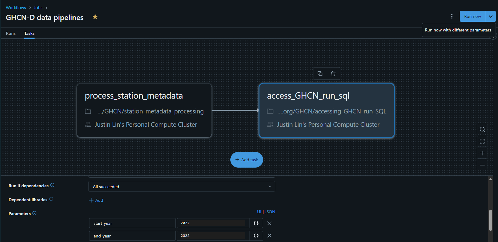
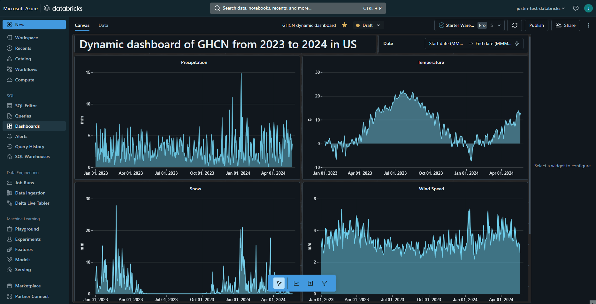

# GHCN-D workflow in Azure DataBricks

## NOAA Global Historical Climatology Network Daily (GHCN-D)
GHCN-Daily is a dataset that contains daily observations over global land areas. It contains station-based measurements from land-based stations worldwide, about two thirds of which are for precipitation measurements only (Menne et al., 2012). GHCN-Daily is a composite of climate records from numerous sources that were merged together and subjected to a common suite of quality assurance reviews (Durre et al., 2010).

## Five core meteorological variables:
- PRCP = Precipitation (tenths of mm)
- SNOW = Snowfall (mm)
- SNWD = Snow depth (mm)
- TMAX = Maximum temperature (tenths of degrees C)
- TMIN = Minimum temperature (tenths of degrees C)

## Instructions:
1. Create an `Azure Databricks` workspace and import the following notebooks:
    - `station_metadata_processing.ipynb` 
    - `accessing_GHCN_run_SQL.ipynb`
2. In the `Workflows` section, create a job that configures tasks to do things automatically.  In this example, I do the following things:
    - Create a job called `GHCN-D data pipelines`.
    - Add two tasks that run the notebooks just imported **in order**.
    - For second task's configuration, specify parameters `start_year` and `end_year`.
    - Click the drop down toggle button next to `Run now`, click `Run now with different parameters`, and modify the year values to fetch the yearly GHCN data of your interests. 
     
    

    
    

     
3. In the `Dashboards` section, create dashboards to visualize the results. 
    - Go to `Data` section, query any results from the tables we created through the data pipeline.
    - In the `Canvas` section, create as many visualizations as you want. On the right side of the panel is where you configure and format the plots.
    - Below is an example of the dynamic dashboard using GHCN data.   

## Dynamic Dashboard in databricks:

 

This is a demo of dynamic dashboard with GHCN data in Databricks. You can interact with the `Date` parameter to automatically see the changes across all four visualizations: `Precipitation`, `Temperature`, `Snow`, and `Wind Speed`.  